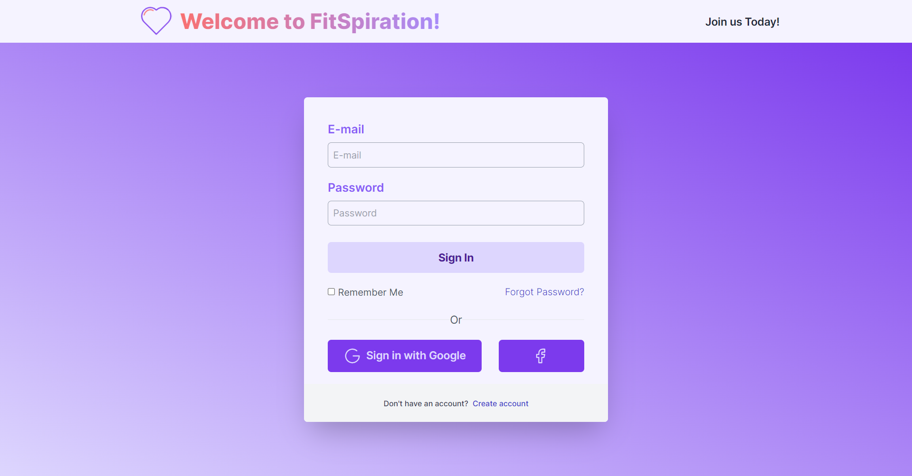

# Sign In Page

A sign-in page built using frontend Javascript framework, React, and utility-first CSS framework, TailwindCSS. 

🔍 Frameworks & Tools:

- **React**: [https://react.dev/](https://react.dev/)
- **TailwindCSS**: [https://tailwindcss.com/](https://tailwindcss.com/)

## 🌐 Live Demo 

Experience the live version of the webpage [here](https://sign-in.netlify.app/).

## 🖼️ Preview



## 🛠️ Installation

Follow these steps to install and run the project on your local machine:

### Clone the Repository

1. Clone this repository to your local machine using the following command:

   ```bash
   git clone https://github.com/Sadhvi10/signin-page.git

### Start the development server

Start the development server (localhost:3000) by typing in the URL input of the web browser.
